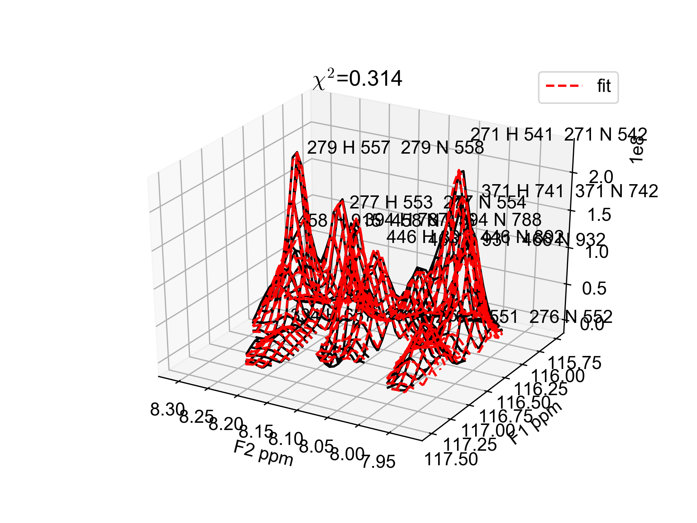
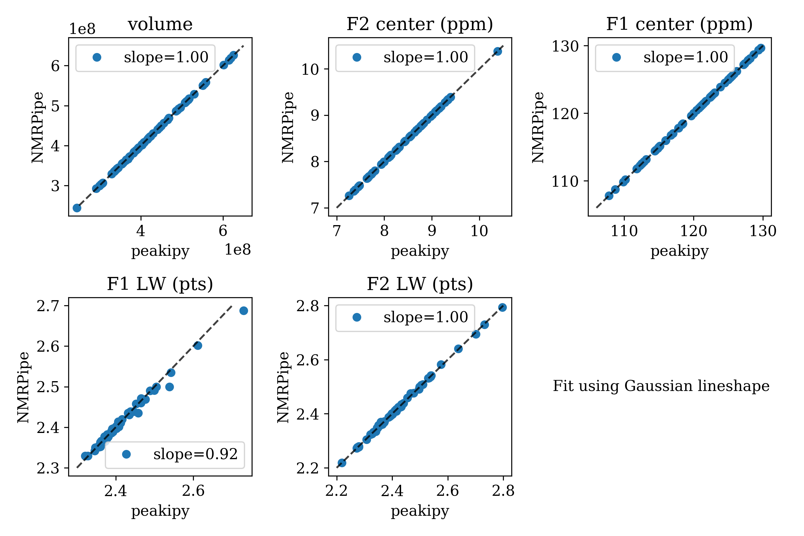

# Peakipy - NMR peak integration/deconvolution using python

[](https://travis-ci.com/j-brady/peakipy)

## Description

Simple deconvolution of NMR peaks for extraction of intensities. Provided an NMRPipe format spectrum (2D or Pseudo 3D)
 and a peak list (NMRPipe, Sparky or Analysis2), overlapped peaks are automatically/interactively clustered and groups
 of overlapped peaks are fitted together using Gaussian, Lorentzian or Pseudo-Voigt (Gaussian + Lorentzian) lineshape.

## Installation

The easiest way to install peakipy is with poetry...

```bash
cd peakipy; poetry install
```

If you don't have poetry you can install it with the following command

```bash
curl -sSL https://raw.githubusercontent.com/sdispater/poetry/master/get-poetry.py | python
```
Otherwise refer to the [poetry documentation](https://poetry.eustace.io/docs/) for more details

You can also install peakipy with `setup.py`. You will need python3.6 or greater installed.

```bash
cd peakipy; python setup.py install
```

At this point the package should be installed and the main scripts (`read_peaklist.py`, `edit_fits.py`, `fit_peaks.py` and `check_fits.py`)
should have been added to your path.

## Inputs

1. Peak list (see below for specification)
2. NMRPipe frequency domain dataset (2D or Pseudo 3D)

There are four main scripts.

1. `read_peaklist.py` is used to convert peak list and select clusters peaks.
2. `edit_fits.py` is used to check and adjust fit parameters interactively (i.e clusters and mask radii) if initial clustering is not satisfactory.
3. `fit_peaks.py` is used to fit clusters of peaks
4. `check_fits.py` is used to check individual fits or groups of fits and make plots.

Below is a description of how to run these scripts.
You can also use the `-h` or `--help` flags for instructions on how to run the programs.

### Peaklists

First you need a peak list in either Sparky, Analysis2 or NMRPipe format.

#### Analysis2 peak list

Example of tab delimited peak list exported directly from Analysis2.

```bash
Number  #       Position F1     Position F2     Sampled None    Assign F1       Assign F2       Assign F3       Height  Volume  Line Width F1 (Hz)  Line Width F2 (Hz)      Line Width F3 (Hz)      Merit   Details Fit Method      Vol. Method
1       1       9.33585 129.67323       2.00000  {23}H[45]       {23}N[46]       2.0    3.91116e+07     2.14891e+08     15.34578        19.24590    None    1.00000 None    parabolic       box sum
2       2       10.38068        129.32604       2.00000  {9}H[17]        {9}N[18]        2.0    6.61262e+07     3.58137e+08     15.20785        19.76284        None    1.00000 None    parabolic       box sum

```

#### Sparky peak list

Minimum

```bash
Assignment  w1  w2
PeakOne 118 7.5
PeakTwo 119 7.4
etc...

```

Also accepted...

```bash
      Assignment         w1         w2        Volume   Data Height   lw1 (hz)   lw2 (hz)
          ALA8N-H    123.410      7.967   2.25e+08      15517405       15.8       20.5
         PHE12N-H    120.353      8.712   3.20e+08      44377264        9.3       16.6
         etc...
```

#### NMRPipe peak list

Default peak list generated by NMRDraw (e.g. test.tab)

```bash
VARS   INDEX X_AXIS Y_AXIS DX DY X_PPM Y_PPM X_HZ Y_HZ XW YW XW_HZ YW_HZ X1 X3 Y1 Y3 HEIGHT DHEIGHT VOL PCHI2 TYPE ASS CLUSTID MEMCNT
FORMAT %5d %9.3f %9.3f %6.3f %6.3f %8.3f %8.3f %9.3f %9.3f %7.3f %7.3f %8.3f %8.3f %4d %4d %4d %4d %+e %+e %+e %.5f %d %s %4d %4d

NULLVALUE -666
NULLSTRING *

    1   159.453    10.230  0.006  0.004    9.336  129.673  7471.831 10516.882   2.886   2.666   16.937   20.268  159  160    9   11 +2.564241e+07 +2.505288e+04 +1.122633e+08 0.00000 1 None    1    1
    2    17.020    13.935  0.002  0.002   10.381  129.326  8307.740 10488.713   2.671   2.730   15.678   20.752   16   18   13   15 +4.326169e+07 +2.389882e+04 +2.338556e+08 0.00000 1 None    2    1
    etc...
```

### NMRPipe Data

The input data should be either a NMRPipe 2D or 3D cube. The dimension order can be specified with the `--dims` flag.
For example if you have a 2D spectrum with shape (F1_size,F2_size) then you should call the scripts using `--dims=0,1`.
If you have a 3D cube with shape (F2_size,F1_size,ID) then you would run the scripts with `--dims=2,1,0` ([F2,ID,F1]
would be `--dims=1,2,0` i.e the indices required to reorder to 0,1,2).
The default dimension order is ID,F1,F2.

### Running read_peaklist.py

Here is an example of how to run read_peaklist.py

```bash
read_peaklist.py peaks.sparky test.ft2 --sparky --show --outfmt=csv
```

This will convert your peak list to into a `pandas DataFrame` and use `threshold_otsu` from `scikit-image` to determine a
 cutoff for selecting overlapping peaks.
These are subsequently grouped into clusters ("CLUSTID" column a la NMRPipe!).
The new peak list with selected clusters is saved as a csv file `peaks.csv` to be used as input for either
`edit_fits.py` or `fit_peaks.py`.
It is possible to set the threshold value manually using the `--thres` option. However, it may be preferable to adjust this parameter within the `edit_fits.py` script.


Clustered peaks are colour coded and singlet peaks are black (shown below).
If you want to edit this plot after running `read_peaklist.py` then you can edit `show_clusters.yml` and re-plot using
`spec.py show_clusters.yml`.


The threshhold level can be adjusted with the `--thres` option like so

```bash
read_peaklist.py peaks.sparky test.ft2 --sparky --show --outfmt=csv --thres=1e6
```

It is also possible to adjust the clustering behaviour by changing the structuring element used for binary closing.

```bash
read_peaklist.py peaks.sparky test.ft2 --dims=0,1,2 --struc_el=disk --struc_size=4, --show
```

Would use a disk shaped structuring element with a radius of 4 points (see the [scikit-image.morpholog](http://scikit-image.org/docs/dev/api/skimage.morphology.html) module for more information).

To adjust the radii used for masking the data to be fitted you can adjust the `--f2radius` and `--f1radius` flags like so (values given in ppm)...

```bash
read_peaklist.py peaks.sparky test.ft2 --dims=0,1,2 --f1radius=0.2 --f2radius=0.04
```

If the automatic clustering is not satisfactory you can manually adjust clusters and fitting start parameters using
`edit_fits.py`.

```bash
edit_fits.py <peaklist> <nmrdata>
```

This command will start a `bokeh` server and cause a tab to open in your internet browser in which you can interactively edit peak fitting parameters.


Use the table on the right to select the cluster(s) you are interested and double click to edit values in the table.
For example if you think peak1 should be fitted with peak2 but they have different clustids then you can simply change peak2's clustid to match peak1's.

Once a set of peaks is selected (or at least one peak within a cluster) you can manually adjust their starting
parameters for fitting (including the X and Y radii for the fitting mask, using the sliders).

The effect of changing these parameters can be visualised by clicking on the `Fit selected` button which will cause a `matplotlib` wireframe plot to popup. Note that you must close this `matplotlib` interactive window before continuing with parameter adjustments (I will try and add a 3D visualisation that works in the browser...).
You will need to have your interactive backend correctly configured by editing your
matplotlibrc file. If you don't know where that is then you can find it by importing matplotlib into your Python interpreter and typing `matplotlib.get_data_path()`.

To test other peak clustering settings you can adjust the contour level (akin to changing `--thres`) or adjust the dimensions of the structuring element used for binary closing.



If you like the parameters you have chosen then you can save the peak list using the `save` button. If you want to return to your edited peak
list at a later stage then run `edit_fits.py` with the edited peak list as your `<peaklist>` argument.

Clicking `Quit` closes the bokeh server.

Following this (or before), `fit_peaks.py` can be run using your (edited) peak list generated by (`edit_peaks.py`) `read_peaklist.py`.

For example...

```bash
fit_peaks.py edited_peaks.csv test.ft2 fits.csv --dims=0,1,2 --lineshape=PV
```

Fits that are likely to need checking are flagged in the `log.txt` file.

If you have a `vclist` style file containing your delay values then you can run
`fit_peaks.py` with the `--vclist` flag.

```bash
fit_peaks.py edited_peaks.csv test.ft2 fits.csv --dims=0,1,2 --lineshape=PV --vclist=vclist
```
This will result in an extra column being added to your `fits.csv` file called `vclist`
containing the corresponding values.

### Excluding peaks

Peaks can be excluded from being fitted either by directly commenting the line in
the `.csv` file containing the peak list i.e add a `#` at the start of the line
you want to exclude. Alternatively, peaks can be excluded by changing the value
in the column entitled `include` from `yes` to `no`. The easiest way to do this is via the `edit_peaks.py` script.

## Protocol

Initial parameters for FWHM, peak centers and fraction are fitted from the sum of all planes in your spectrum (for best signal to
 noise). Following this, the default method is to fix center, linewidth and fraction parameters only fitting the amplitudes
 for each plane. If you want to float all parameters, this can be done with `--fix=None` or you could just float the
 linewidths and amplitudes with `--fix=fraction,center`.


## Outputs

1. Pandas DataFrame containing fitted intensities/linewidths/centers etc.

```bash
,fit_prefix,assignment,amp,amp_err,center_x,center_y,sigma_x,sigma_y,fraction,clustid,plane,x_radius,y_radius,x_radius_ppm,y_radius_ppm,lineshape,fwhm_x,fwhm_y,center_x_ppm,center_y_ppm,sigma_x_ppm,sigma_y_ppm,fwhm_x_ppm,fwhm_y_ppm,fwhm_x_hz,fwhm_y_hz
0,_None_,None,291803398.52980924,5502183.185104156,158.44747896487527,9.264911100915297,1.1610674220702277,1.160506074898704,0.0,1,0,4.773,3.734,0.035,0.35,G,2.3221348441404555,2.321012149797408,9.336283145411077,129.6698850201278,0.008514304888101518,0.10878688239041588,0.017028609776203036,0.21757376478083176,13.628064792721176,17.645884354478063
1,_None_,None,197443035.67109975,3671708.463467884,158.44747896487527,9.264911100915297,1.1610674220702277,1.160506074898704,0.0,1,1,4.773,3.734,0.035,0.35,G,2.3221348441404555,2.321012149797408,9.336283145411077,129.6698850201278,0.008514304888101518,0.10878688239041588,0.017028609776203036,0.21757376478083176,13.628064792721176,17.645884354478063
etc...
```

2. If `--plot=<path>` option selected the first plane of each fit will be plotted in <path> with the files named according to the cluster ID (clustid) of the fit. Adding `--show` option calls `plt.show()` on each fit so you can see what it looks like. However, using `check_fits.py` should be preferable since plotting the fits during fitting
slows down the process a lot.

3. To plot fits for all planes or interactively check them you can run `check_fits.py`

```bash
check_fits.py fits.csv test.ft2 --dims=0,1,2 --clusters=1,10,20 --show --outname=plot.pdf
```
Will plot clusters 1,10 and 20 showing each plane in an interactive matplotlib window and save the plots to a multipage pdf called plot.pdf. Calling `check_fits.py`
with the `--first` flag results in only the first plane of each fit being plotted.

Run `check_fits.py -h` for more options.

You can explore the output data conveniently with `pandas`.

```python
In [1]: import pandas as pd

In [2]: import matplotlib.pyplot as plt

In [3]: data = pd.read_csv("fits.csv")

In [4]: groups = data.groupby("assignment")

In [5]: for ind, group in groups:
   ...:     plt.errorbar(group.vclist,group.amp,yerr=group.amp_err,fmt="o",label=group.assignment.iloc[0])
   ...:     plt.legend()
   ...:     plt.show()
```

## Pseudo-Voigt model


Where Gaussian lineshape is


And Lorentzian is


The fit minimises the residuals of the functions in each dimension


Fraction parameter is fraction of Lorentzian lineshape.

The linewidth for the G lineshape is


The linewidth for PV and L lineshapes is


## Test data

To test the program for yourself `cd` into the `test` directory. I wrote some tests for the code itself which should be run from the top directory like so `python test/test_core.py`.

## Comparison with NMRPipe

A sanity check... Peak intensities were fit using the nlinLS program from NMRPipe and compared with the output from peakipy for the same dataset.



## Homage to FuDA

If you would rather use FuDA then try running `read_peaklist.py` with the `--fuda` flag to create a FuDA parameter file
(params.fuda) and peak list (peaks.fuda).
This should hopefully save you some time on configuration.

## Acknowledgements

Thanks to Jonathan Helmus for writing the wonderful `nmrglue` package.
The `lmfit` team for their awesome work.
`bokeh` and `matplotlib` for beautiful plotting.
`scikit-image`!

My colleagues, Rui Huang, Alex Conicella, Enrico Rennella, Rob Harkness and Tae Hun Kim for their extremely helpful input.
