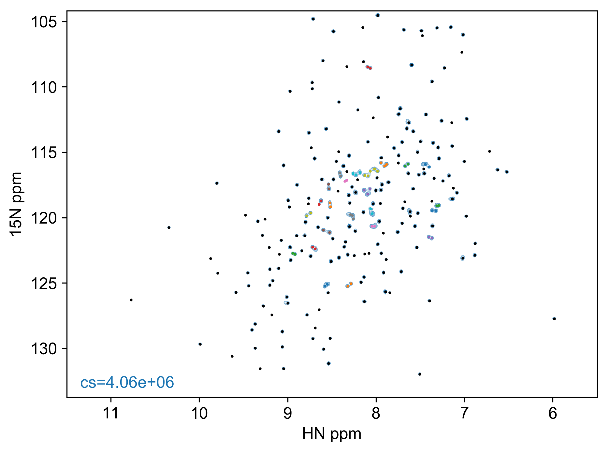

# PeakIpy - NMR peak integration/deconvolution using python

## Description

Simple deconvolution of NMR peaks for extraction of intensities. Provided an NMRPipe format spectrum (2D or Pseudo 3D) and a peak list (NMRPipe, Sparky or Analysis2), overlapped peaks are automatically/interactively clustered and groups of overlapped peaks are fitted together using Gaussian, Lorentzian or Pseudo-Voigt (Gaussian + Lorentzian).

## Installation

With poetry...

```bash
cd peakipy; poetry install
```

With setup.py you will need python3.6 or greater installed.

```bash
cd peakipy; python setup.py install
```

## Inputs

1. peaklist
2. NMRPipe dataset (Pseudo 3D)

There are three main scripts.

1. read_peaklist.py is used to convert peak list and select clusters peaks.
2. run_check_fits.py is used to check and adjust fit parameters (i.e clusters and mask radii) if initial clustering is not satisfactory.
3. fit_peaks.py is used to fit clusters of peaks


### Running read_peaklist.py

First you need a peak list either Sparky or Analysis2 format.

Here is an example of how to run read_peaklist.py

```bash
read_peaklist.py peaks.sparky test.ft2 --sparky --show --outfmt=csv
```

This will convert your peaklist to into a `pandas DataFrame` and use `threshold_otsu` from `scikit-learn` to determine a cutoff for selecting overlapping peaks.
These are subsequently grouped into clusters ("CLUSTID" column a la NMRPipe!)



Clustered peaks are colour coded. Singlet peaks are black. If you want to edit this after running `read_peaklist.py` then you can edit `show_clusters.yml` and re-plot using `spec.py show_clusters.yml`

```bash
read_peaklist.py peaks.sparky test.ft2 --dims=0,1,2 --show --outfmt=csv
```

If the automatic clustering is not satisfactory you can manually adjust clusters and fitting start parameters using `run_check_fits.py`.

```bash
run_check_fits.py <peaklist> <nmrdata>
```


Select the cluster you are interested in using the table and double click to edit the cluster numbers. Once a set of peaks is selected you can manually adjust their starting parameters for fitting (including the X and Y radii for the fitting mask)


## Protocol

Initial parameters for FWHM,  


## Outputs

1. Pandas DataFrame containing fitted intensities/linewidths/centers etc.
2. If `--plot=<path>` option selected the first plane of each fit will be plotted in <path> with the files named according to the cluster ID (CLUSTID) of the fit. Adding `--show` option calls `plt.show()` on each fit so you can see what it looks like.


## Pseudo-Voigt model


Where Gaussian lineshape is


And Lorentzian is


The fit minimises the residuals of the functions in each dimension


Fraction parameter is fraction of Lorentzian lineshape.

The linewidth for a Gaussian is


## Test data

To test the program for yourself cd into the test dir and


## Acknowledgements

Thanks to Jonathan Helmus for writing the wonderful `nmrglue` package.
The `lmfit` team for their awesome work.
`Bokeh` and `Matplotlib` for beautiful plotting.
`Scikit-image`!

My colleagues, Rui Huang, Alex Conicella, Enrico Rennella and Rob Harkness for they extremely helpful input.


## To do

1. Add function to read_peaklist.py that allows output to FuDA format parameter file

2. add flag to include vclist to output dataframe

3. Normalize peaks

4. Multiprocessor

5. Script to check fits and add column with x_radius and y_radius so that you can edit the parameters and rerun specific fits.
